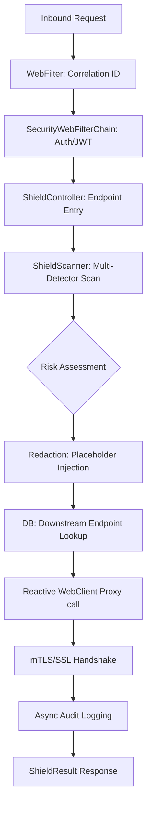

# 🛡️ Artifact-Shield Enterprise: The Reactive AI Security Gateway

**Artifact-Shield** is the definitive perimeter defense for modern AI adoption. It acts as a high-performance, non-blocking bridge between your internal applications and external Large Language Models (LLMs), ensuring that no PII, credential, or financial data ever leaves your network.

---

### 🌐 [Live Documentation Site](https://dhoondlay.github.io/artifact-shield/)
*The definitive guide for installation, deployment, and security hardening.*

---

## 📚 Documentation Index

To get started with Artifact-Shield, please refer to our comprehensive documentation library:

*   **[Troubleshooting Guide](./docs/troubleshooting.md)**: Resolution for SSL, DB locks, and performance issues.
*   **[Enterprise Security (OIDC)](./docs/security-integration.md)**: Connect with Azure AD, Okta, and Keycloak.
*   **[Database Migration](./docs/database-migration.md)**: Move from H2 to Production PostgreSQL.
*   **[Observability & Monitoring](./docs/observability.md)**: Prometheus, Grafana, and Splunk setup.
*   **[Feature Deep-Dive](./docs/feature-guide.md)**: Technical overview of core system pillars.
*   **[Configuration Reference](./docs/configuration-reference.md)**: Every YAML key and DB table explained.
*   **[Developer Guide](./docs/developer-guide.md)**: How to add new custom detectors.
*   **[Security Scenarios](./docs/scenarios.md)**: Benchmark outputs for different risk levels.
*   **[Contributing Guide](./CONTRIBUTING.md)**: Standard for community participation.
*   **[Security Policy](./SECURITY.md)**: Responsible disclosure process.

---

## 🏗️ High-Level Architecture & Request Lifecycle

Artifact-Shield is built on a **fully reactive, non-blocking stack** (Spring WebFlux + Project Reactor) to support high-concurrency enterprise proxying. 

### 🔄 The 11-Step Redaction Pipeline

Every single bytes flowing through the gateway undergoes a rigorous deterministic inspection:



### 📋 Step-by-Step Breakdown

1.  **Correlation ID Filter**: Every request is assigned a unique `X-Correlation-ID` for end-to-end traceability across reactive threads.
2.  **Security Layer**: If enabled, the gateway validates a JWT/OAuth2 token before allowing the prompt to be scanned.
3.  **Scanner Logic**: The gateway triggers parallel detectors (Regex + Luhn) to identify patterns without using AI (zero hallucinations).
4.  **Risk Scorer**: Matches are weighted (e.g., a SSN is 50 pts, Email is 20 pts). Scores > 75 are flagged as `CRITICAL`.
5.  **Sanitization Engine**: The raw text is rewritten using placeholder templates (e.g., `[REDACTED_AWS_KEY]`).
6.  **Downstream Resolver**: The system looks up the target LLM configuration (URL, Token, mTLS certificates) from the database.
7.  **Reactive Proxy**: Using `WebClient`, the gateway initiates a non-blocking outbound call to the LLM with the sanitized script.
8.  **mTLS Support**: If configured, the proxy performs mutual TLS certificate verification with the LLM server.
9.  **Audit Trail**: The system records the risk metrics, detected patterns, and latencies in the audit database (offloaded to a separate I/O thread pool).

---

## 🕹️ Use Cases & Scenarios

| User Action | Input Example | Expected Behavior | Final Output |
| :--- | :--- | :--- | :--- |
| **Simple Redact (`R`)** | `"Email me at test@test.com"` | Scans and redacts matching patterns locally. | `{"sanitizedText": "Email me at [REDACTED_EMAIL]"}` |
| **LLM Proxy (`F`)** | `"Analyze sk-live-1234..."` | Sanitizes credentials and **forwards to LLM**. | `{"llmResponse": "I detected a redacted key..."}` |
| **Analyze Only (`A`)** | `"Simple prompt"` | Scans text for risk only; provides metadata. | `{"severity": "CLEAN", "riskScore": 0}` |
| **Abort Policy** | Any action | If `block-critical-risk` is ON, 100-score risk blocks the call. | `{"llmResponse": "BLOCKED: Request blocked..."}` |

---

## 🛠️ Management & Configuration Guide

### 📂 External Properties (`application.yml`)
The engine is highly tunable via standard Spring configuration:
- `shield.enabled`: Global toggle.
- `shield.security.enabled`: Activates JWT/OAuth2 protection.
- `shield.block-critical-risk`: Choose between "Block" or "Sanitize & Forward" for 100-score risks.

### 💾 Dynamic Administration (Database)
The heart of the gateway is managed via three core tables (H2 or PostgreSQL):
1.  **`shield_patterns`**: Create and enable dynamic regex rules at runtime.
2.  **`downstream_configs`**: Manage LLM endpoints, authentication tokens, and certificate paths.
3.  **`audit_logs`**: Full compliance trail for every system interaction.

### 🖥️ Built-in Admin Dashboard
Access the dashboard via `http://localhost:8080` (requires active server) to:
*   View real-time system stats and request counts.
*   Enable/Disable detectors on the fly.
*   Monitor audit logs for security forensics.

---

## 🚀 Deployment & Operations

### **Local Setup**
```bash
./mvnw clean install
./mvnw spring-boot:run
```

### **Docker Deployment**
```bash
docker build -t artifact-shield:1.0.0 .
docker run -p 8080:8080 artifact-shield:1.0.0
```

### **API Documentation**
The gateway exposes a fully compliant OpenAPI / Swagger UI at:
- `http://localhost:8080/swagger-ui.html`

---
*Ensuring that Enterprise AI remains both Powerful and Private.*